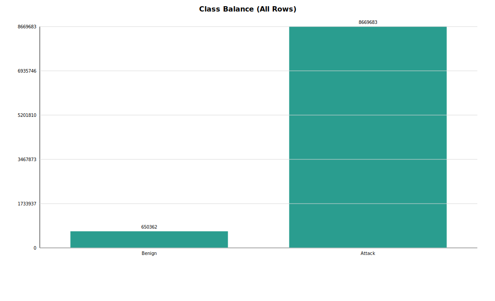
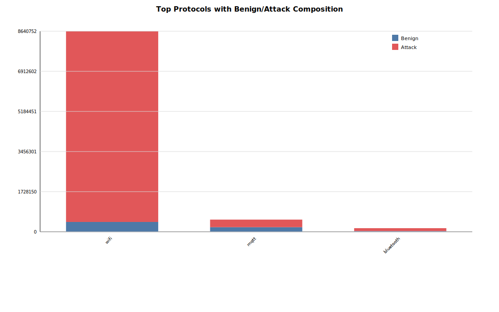
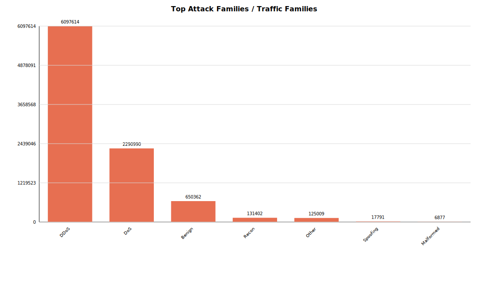
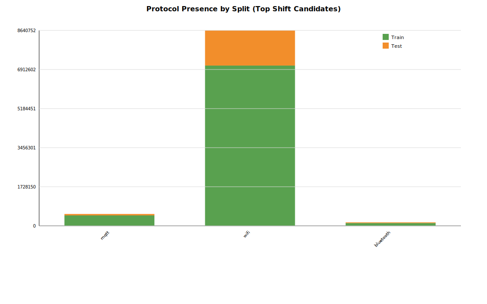
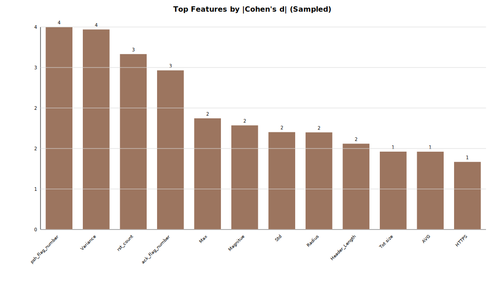
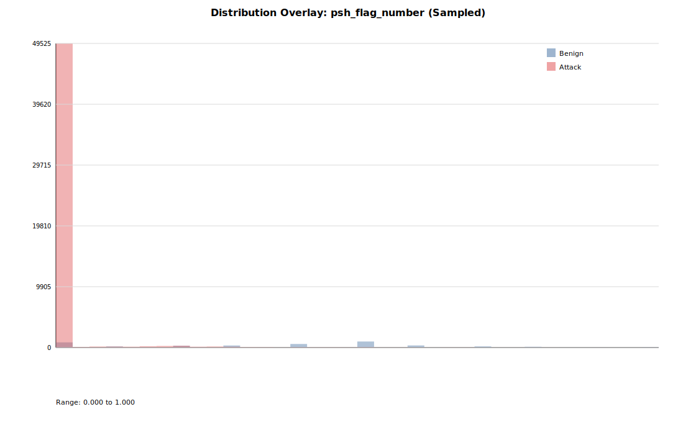
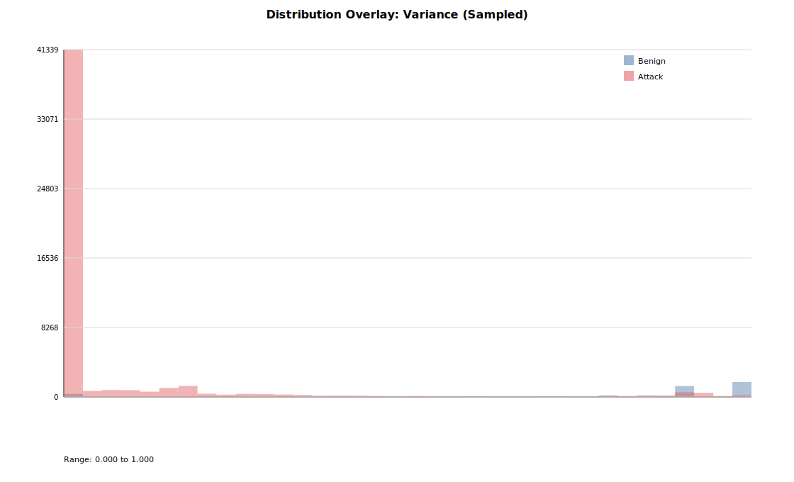
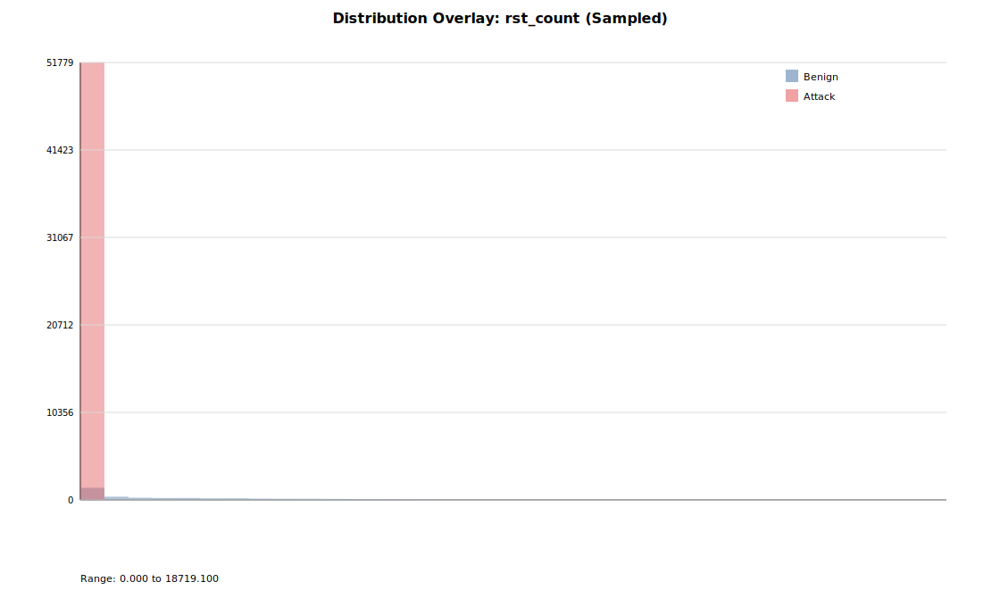

# Advanced EDA Report: CICIoMT2024 Merged Metadata Dataset

Generated: 2026-03-05 23:14:54

## Thesis Objective Alignment
This EDA is framed for a **flow-based IoMT IDS (benign vs malicious)** and focuses on class imbalance, protocol/attack composition, split drift, and feature separability to inform thresholding, robustness checks, and explainability priorities.

## Dataset Scope
- Total rows analyzed (full metadata pass): **9,320,045**
- Feature columns: **45**
- Metadata columns: **20**
- Sampled rows for feature-level analysis: benign=3,913, attack=51,879

## Key Plots
- 
- 
- 
- 
- 
- 
- 
- 

## Key Tables
- `tables/class_balance.csv`
- `tables/split_label_balance.csv`
- `tables/protocol_label_counts.csv`
- `tables/attack_family_counts.csv`
- `tables/top_attack_names.csv`
- `tables/train_test_protocol_shift.csv`
- `tables/feature_separability_sampled.csv`
- `tables/feature_quantiles_top8_sampled.csv`
- `tables/top_feature_correlations_sampled.csv`
- `tables/attack_family_by_protocol_top10x8.csv`

## Interpretation
- 1. Severe class imbalance persists: attack share is **93.02%** vs benign **6.98%**. For IDS thresholding, prioritize PR-AUC/FPR-constrained recall rather than raw accuracy.
- 2. Protocol mix is concentrated: top protocols are wifi (8,640,752), mqtt (524,217), bluetooth (155,076). Model evaluation should include per-protocol slices to avoid over-crediting dominant traffic types.
- 3. Traffic/attack-family concentration is high: DDoS (6,097,614), DoS (2,290,990), Benign (650,362), Recon (131,402), Other (125,009). This can bias learning toward frequent families and suppress recall on rare attacks.
- 4. Attack-name dominance (top): TCP_IP-DDoS-UDP1 (411,824), TCP_IP-DDoS-ICMP2 (390,510), TCP_IP-DDoS-UDP2 (363,711), TCP_IP-DDoS-ICMP1 (348,945), MQTT-DDoS-Connect_Flood (214,952). Use macro metrics and family-wise confusion matrices to track long-tail behavior.
- 5. Train-test attack-rate delta is **+4.91%** (test minus train). Any threshold policy selected on train/validation should be rechecked on test under fixed FPR targets.
- 6. Iterative deep dive triggered: dominant family 'DDoS' occupies **65.42%** of all rows. The report includes family-by-protocol tables to inspect concentration pockets that may drive shortcut learning.
- 7. Additional shift alert: noticeable split-level attack-rate drift suggests careful validation design (e.g., stratified CV by family/protocol) before final model claims.

## Modeling Implications for This Thesis
- Use **class-aware evaluation** (PR-AUC, recall@FPR<=1%, F1) and not accuracy-dominated decisions.
- Calibrate thresholds using validation slices by protocol/family; then freeze and evaluate once on test.
- For robustness experiments, prioritize high-impact features from `feature_separability_sampled.csv` and keep perturbations physically plausible.
- For explainability, first report global importance for top discriminative features, then local explanations on false positives and missed attacks.

## Reproducibility
- Random seed: `20260305`
- Feature sample rate: `0.006`
- Data sources: `data/ciciomt2024/merged/metadata_train.csv`, `metadata_test.csv`
